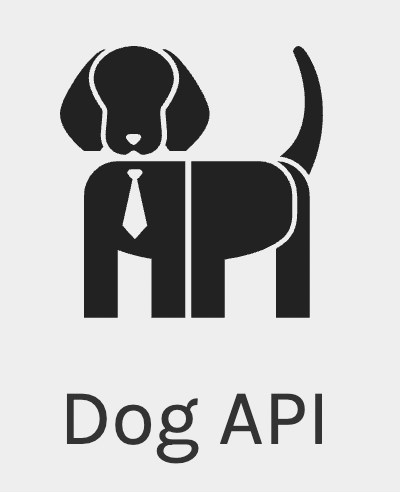

# Dog's Breeds Photos

> JavaScript and API webpage to show dog breeds using Fetch, Promises and Async Await.
> using the github `public-apis`.

[GitHub `public-apis`](https://github.com/public-apis/public-apis/?target=_blank)

And specifically using `Dog API` The internet's biggest collection of open source dog pictures.

<a href="https://dog.ceo/dog-api/" target="_blank">Dog API</a>

<!-- # Please visit the website and try! -->
