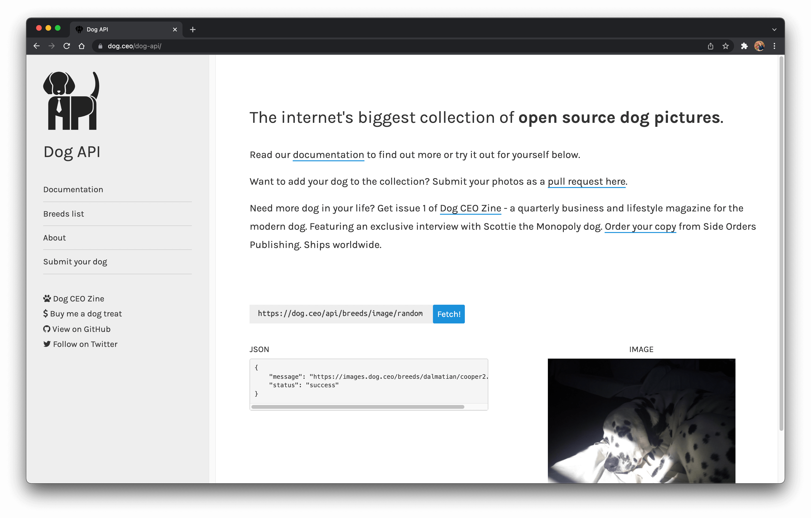

# Dog's Breeds Photos

> JavaScript and API webpage to show dog breeds using Fetch, Promises and Async Await.

---

## Please visit the website and try

<a href="https://dog-breeds-caeserlondon.netlify.app" target="_blank">`Dog Breeds Photos`</a>

https://dog-breeds-caeserlondon.netlify.app

---

> using the github **public-apis** .

[`GitHub public-apis`](https://github.com/public-apis/public-apis/?target=_blank)

And specifically using **Dog API** The internet's biggest collection of open source dog pictures.

[`Dog API`](https://dog.ceo/dog-api/?target=_blank)

